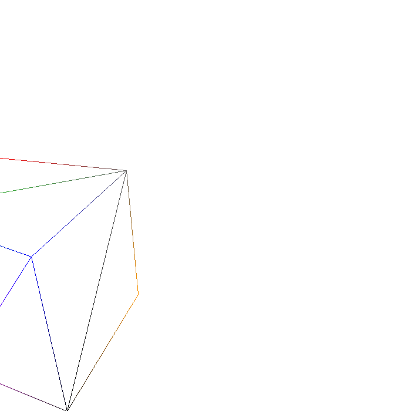
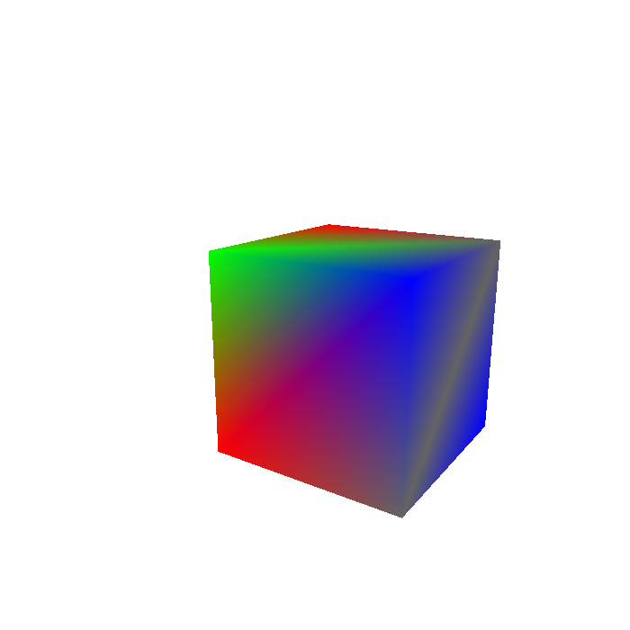

# Software Rasterizer: Forward Rendering Pipeline (CENG 477 - Fall 2024-25)
Developed by: Barış Taştan & Bahar Salman

This C++ project implements a software rasterizer simulating key stages of the forward rendering pipeline.

## Features
- **Modeling & Viewing Transformations:** Apply translations, rotations, and scaling.
- **Rasterization:** Triangle rendering in wireframe and solid modes.
- **Projections:** Support for orthographic and perspective projections.
- **Backface Culling:** Enable/disable backface culling based on input.
- **Clipping:** Uses Liang-Barsky algorithms for wireframe mode.
- **Depth Buffer:** Correct rendering using z-buffering.

### Usage
```bash
make rasterizer
./rasterizer <input_file_name>
```

### Input/Output
- **Input:** XML-formatted scene files.
- **Output:** `.ppm` image files.




